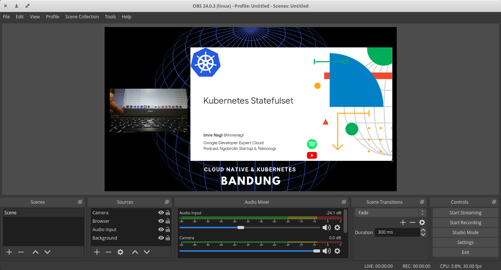

#Recording Meetup Event
This is Recording tutorial for you who held meetup event.

## Prerequisites
- [Open Broadcaster Software](https://obsproject.com/)
- IP camera Software ([IP Webcam Android](https://play.google.com/store/apps/details?id=com.pas.webcam))
- Smartphone Tripod
- This tutorial using Linux operating system & Android phone, you can adjust to your environment if you using MAC & IOS phone :p.

## Tutorial
1. Make sure your laptop has Open Broadcaster Software installed and your phone has IP Webcam installed.
2. Make sure your laptop and phone connected into the same network (I recommend to active tethering in your phone and connect your laptop into the network to avoid packet route into Access Point first).
3. Create Background Source
- In `Open Broadcaster Software`, Add source with Type `image`
- Change the source name into `background`
- Image Files: select your background image, we provide background in `static/recording/resources/`
4. Create Audio Input
- In `Open Broadcaster Software`, Add source with Type `Audio Input Capture`
- Change the source name into `Audio Input`
- Select the devices.
5. Create Slide Source
- Open the slide, present the slide (I recommend using google slide) and the new window browser will open, make the window fullscreen.
- In `Open Broadcaster Software`, Add source with Type `Window Capture`.
- Change the source name into `Browser`.
- Select the `spesific window`.
- Resize the window.
6. Create Camera
- Open IP Webcam in your phone, change the video preferences
- Start the server.
- Get the IP address, for example `http://173.16.0.4:8080`. Your video URL will be `http://173.16.0.4:8080/video`.
- In `Open Broadcaster Software`, Add source with Type `Media Source`.
- Change the source name into `Camera`.
- Unclick the `local file`.
- Fill the `input` with `http://173.16.0.4:8080/video`.
- Resize the window.

7. Start Recording
Some tips:
- Use Pointer
- After first presentation, just edit/change the `Browser Source` into another presentation window.

